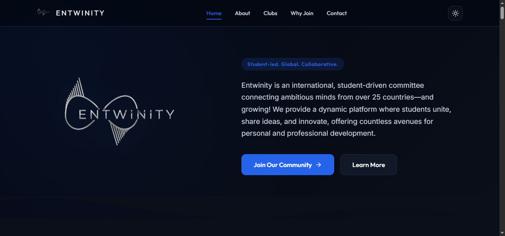

# Entwinity Student Community Website

Welcome to the official website repository for **Entwinity**.

Entwinity is a global, student-led community that brings together ambitious students from more than **25 countries**. Our goal is to create a space where students can connect, collaborate, develop new skills, and take on leadership opportunities—all completely free.

This website serves as the central hub for the community, where visitors can learn about Entwinity, explore our clubs, connect with the community, and get in touch with our team.



---

## Our Vision

> **"We provide a dynamic platform where students unite, share ideas, and innovate, offering countless avenues for personal and professional development."**

We believe that meaningful learning extends beyond the classroom. Entwinity provides students with opportunities to work on real projects, build friendships across borders, develop leadership skills, and become part of an international community driven by curiosity and collaboration.

---

## Built With

The website is intentionally lightweight and easy to maintain. It is built using only standard web technologies, making it simple to host on platforms such as GitHub Pages, Netlify, or Vercel without requiring a backend server.

* **HTML5** for the website structure
* **CSS3** with Flexbox and Grid for responsive layouts
* **Vanilla JavaScript (ES6)** for dynamic functionality
* **Lucide Icons** for clean, lightweight icons
* **Google Fonts** (Outfit and Inter) for typography
* **Python** for the mail service utilizing **Flask**
Since there are no heavy frameworks or unnecessary dependencies, the site loads quickly and is easy for anyone to understand and modify.

---

## Features

### Dynamic Club Directory

Rather than hardcoding every club into the website, all club information is stored in a simple `clubs.csv` file. Whenever the website loads, it reads the CSV file and automatically creates a card for each club.

Each club includes:

* Club name
* Short description
* WhatsApp community link

Adding a new club is as easy as adding another row to the CSV file:

```csv
Club Name,Description,WhatsApp Link
Programming Club,Learn and build software together,https://chat.whatsapp.com/...
```

No changes to the HTML are required.

To make the interface feel more polished, the website also assigns suitable icons automatically based on the club's name (for example, robotics, programming, research, entrepreneurship, and more).

---

### Python Backend Mail Service

This service is used to receive messages from the contact form and send them to the Entwinity team.
It is built using the flask framework and the Brevo Email API.
It handles json data from the post requests from javascript, and sends the data to the Entwinity team via email.

---

### Light and Dark Mode

Visitors can switch between light and dark themes using the toggle in the navigation bar. Their preference is saved in the browser, so the selected theme is remembered the next time they visit.

---

### Contact Form

The Contact Us section allows visitors to reach the Entwinity team directly.

The form collects:

* Name
* Email
* Country
* Institution or School
* Subject
* Message

Basic validation is performed before submission to ensure all required fields are completed and email addresses are entered correctly.

Messages are then sent to the Entwinity team using a backend python flask service [main.py], [mail.service] which is connected to **Brevo Email API**, providing a simple way to receive enquiries.

### Development

This project was developed with the assistance of AI coding tools. The generated code was reviewed, customized, and integrated to meet the project's requirements.
